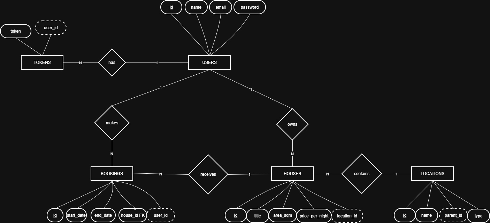

# LS Project Report

## Introduction
This document contains the relevant design and implementation aspects of LS project's, including the Single Page Application (SPA) frontend implementation and the backend API that supports it.

## Modeling the database
### Conceptual model
The following diagram holds the Entity-Relationship model for the information managed by the system.



We highlight the following aspects:
- **Hierarchical Locations**: Locations are structured in a tree-like hierarchy (e.g., Country -> Region -> District -> Municipality -> Locality) using a self-referencing relationship.
- **Token-based Authentication**: Secure session management using UUID tokens linked to user accounts.
- **House-Location Association**: Every rental house must be tied to a specific location from the hierarchy.
- **Booking Management**: Bookings connect users and houses over specific date intervals.

The conceptual model has the following restrictions:
- A user can have multiple active session tokens.
- A booking must have a start date that is strictly before the end date.
- Booking periods for a specific house cannot overlap with other bookings for the same house.
- A location cannot be deleted if there are houses or child locations associated with it (enforced via constraints).

### Physical Model
The physical model of the database is available in [src/main/sql/createSchema.sql](src/main/sql/createSchema.sql).

We highlight the following aspects of this model:
- **Data Integrity**: Extensive use of `ON DELETE CASCADE` for tokens and bookings, and `ON DELETE RESTRICT` for locations to ensure consistent state.
- **Constraints**: Use of `CHECK` constraints to validate that `area_sqm` and `price_per_night` are positive, and that booking `end_date` is after `start_date`.
- **Enum Types**: Implementation of a custom `location_type` enum to restrict the possible types of geographical locations.
- **UUIDs**: Automatic generation of session tokens using `gen_random_uuid()` for enhanced security.

## Software organization
### Open-API Specification
The Open-API Specification is available in [docs/house-rentals.yaml](docs/house-rentals.yaml).

In our Open-API specification, we highlight the following aspects:
- **Security**: Use of Bearer Authentication with UUID format for all protected endpoints.
- **Pagination**: Consistent use of `skip` and `limit` parameters for all listing endpoints (locations, houses, bookings).
- **Hierarchical Navigation**: Endpoints to retrieve children of a location and the full path from the root.
- **Price Prediction**: An endpoint that provides price estimates based on historical data for a specific location.
- **Availability Endpoints**: Endpoints for checking available days and house-specific bookings (via `/bookings?hid={id}`) to support SPA scheduling features.
- **User-Specific Bookings**: Endpoints to retrieve bookings for specific users or authenticated users.

### Request Details
A request typically flows through the following layers:
1. **HTTP Routing**: `http4k` routes the incoming request to the appropriate `WebAPI` handler in the `pt.isel.ls.webapi` package.
2. **WebAPI Layer**: Handles JSON decoding/encoding and performs manual input validation (e.g., checking if names are blank, numeric ranges, and token presence).
3. **Service Layer**: Implements business logic (e.g., verifying token ownership, checking booking availability) and coordinates data access.
4. **Data Access Layer**: Executes SQL queries against the database using JDBC.

Relevant classes and functions:
- `App`: Configures the routing and initializes the application components.
- `handleRequest`: A utility function that centralizes request logging and exception handling.
- `DBManager`: Manages the database connection lifecycle and provides an execution wrapper.
- `PricePredictionService`: Implements a linear regression algorithm to predict rental prices.

Request parameters are validated in the `WebAPI` layer before being passed to the services. This includes path parameters, query parameters, and request body fields.

### Connection Management
Connections are managed by the `DBManager` class, which uses `PGSimpleDataSource`. 
- **Creation**: A connection is obtained via `dataSource.connection` when a database operation is requested.
- **Lifecycle**: The `execute` method in `DBManager` ensures that if it opens a new connection, it is automatically closed in a `finally` block after the operation completes.
- **Transaction Scopes**: Current implementation allows passing an existing `Connection` to data access methods to support sharing a connection across multiple calls, though explicit transaction management (begin/commit/rollback) is not yet fully exposed at the service level.

### Data Access
We use the Repository pattern with interfaces defined in `pt.isel.ls.data` and JDBC-based implementations in `pt.isel.ls.data.jdbc`.
- **Created Classes**: `UserDataJDBC`, `TokenDataJDBC`, `LocationDataJDBC`, `HouseDataJDBC`, and `BookingDataJDBC`.
- **Non-trivial SQL**:
    - **Booking Conflicts**: Detection of overlapping dates using `start_date <= ? AND end_date >= ?`.
    - **Hierarchical Path**: Currently implemented via iterative queries in `getLocationPath` (traversing up the parent chain).

### Caching
To optimize performance, we implemented an in-memory cache for house details:
- **`HouseDetailsCache`**: Stores recently accessed house details to reduce database queries.
- **Configuration**: The cache size is configurable via the `HOUSE_DETAILS_CACHE_SIZE` environment variable (defaults to 10).


# Frontend — Single Page Application

The frontend is implemented as a **Single Page Application (SPA)** served as static content from the `static-content/sparouter` directory. Navigation is entirely hash-based using `window.location.hash`, meaning the page never fully reloads — only the content area is updated dynamically. The router intelligently maps URL hash patterns to handler functions, supporting both literal paths (e.g., `#houses`) and parameterized paths (e.g., `#houses/:id`).

### Architecture

The SPA is organized around five main layers that separate concerns and promote maintainability:

- **DSL (`dsl/html-dsl.js`):** A small JavaScript Domain-Specific Language that wraps the DOM API into composable helper functions, eliminating the need for direct calls to `document.createElement` and other low-level DOM operations throughout the codebase. This provides a more declarative, functional approach to building UI components. For example:

```js
  // Instead of low-level DOM calls:
  const d = document.createElement('div');
  const h1 = document.createElement('h1');
  h1.textContent = 'Title';
  d.appendChild(h1);

  // The DSL allows clean, composable code:
  div(
    h1('Title'),
    p('Some text')
  )
```

  This makes view code significantly more readable, maintainable, and less error-prone.

- **Router (`router.js`):** A lightweight client-side router that intelligently maps hash paths to handler functions. The router supports both exact string paths and parameterized paths using a `:parameter` syntax:

```js
  router.addRouteHandler("home", commonHandlers.getHome);
  router.addRouteHandler("houses", houseHandlers.getHouses);
  router.addRouteHandler("houses/:id", houseHandlers.getHouseDetail);
  router.addRouteHandler("bookings/:id/edit", bookingHandlers.editBooking);
```

  On every `hashchange` event, the router resolves the current path and invokes the matching handler, passing the main content container as an argument. The router also supports a default handler for unmatched routes, typically redirecting to the home page.

- **Handlers (`handlers/`):** Each handler (imported from modules like `house-handlers.js`, `booking-handlers.js`, etc.) is an async function responsible for:
  - Fetching required data from the API using service layer functions
  - Handling errors gracefully with user-friendly messages
  - Rendering the appropriate view into the main content area
  - Displaying a skeleton loader while data is being fetched
  - Falling back to inline error states if the request fails

- **Views (`views/`):** Pure functions that receive data and return DOM elements constructed using the DSL. Views have no side effects — they only build and return UI trees. This pure functional approach makes views testable and predictable. Examples include `houseViews`, `bookingViews`, `userViews`, etc.

- **Services (`services/`):** Thin wrappers around `fetch` calls to the REST API that handle the HTTP layer. Each service module corresponds to a resource type:
  - `auth-service.js`: User registration, login, logout
  - `house-service.js`: House listing, details, creation, availability
  - `booking-service.js`: Booking CRUD operations and booking queries
  - `user-service.js`: User profile operations
  - `location-service.js`: Location hierarchy and details
  - `prediction-service.js`: Price prediction requests
  - `api.js`: Base request function with centralized error handling and Bearer token management

### Routing

Routes are registered in `index.js` at page load:

```js
router.addRouteHandler("home", commonHandlers.getHome);
router.addRouteHandler("houses", houseHandlers.getHouses);
router.addRouteHandler("houses/create", houseHandlers.getCreateHouse);
router.addRouteHandler("houses/:id", houseHandlers.getHouseDetail);
router.addRouteHandler("houses/:id/available-days", houseHandlers.getAvailableDays);
router.addRouteHandler("houses/:id/bookings", bookingHandlers.getHouseBookings);
router.addRouteHandler("houses/:id/bookings/create", bookingHandlers.getCreateBooking);
router.addRouteHandler("locations/:id", locationHandlers.getLocationDetails);
router.addRouteHandler("locations/create", locationHandlers.getCreateLocation);
router.addRouteHandler("bookings/me", bookingHandlers.getMyBookings);
router.addRouteHandler("bookings/:id", bookingHandlers.getBookingDetails);
router.addRouteHandler("bookings/:id/edit", bookingHandlers.editBooking);
router.addRouteHandler("login", authHandlers.getLogin);
router.addRouteHandler("register", authHandlers.getRegister);
router.addRouteHandler("logout", authHandlers.logout);
router.addRouteHandler("profile", userHandlers.getProfile);
router.addRouteHandler("profile/edit", userHandlers.editProfile);
router.addRouteHandler("users/:id", userHandlers.getUserDetails);
router.addRouteHandler("users/:id/bookings", bookingHandlers.getUserBookings);
```

Query parameters (e.g., `skip`, `limit`, `districtId`, `startDate`, `endDate`) are read directly from the hash query string, keeping all navigation state in the URL. For example: `#houses?skip=10&limit=20&locationId=5`.

### Location Filtering

The SPA provides location-based filtering for browsing houses. Users can navigate to specific location details via `#locations/:id` routes and filter house listings by location. Selecting a location updates the hash with the corresponding `locationId` query parameter (e.g., `#houses?locationId=42`), which the house listing handler uses to filter results by walking each house's location hierarchy to determine if it matches the selected location or its children.

### House Creation

When creating a house, users navigate to `#houses/create` and select a location by name from a dropdown. The dropdown is populated from the `/locations` API at the time the create form is rendered. Internally, only the numeric `locationId` is sent to the API — the type (district, municipality, etc.) is determined by the server based on the location record itself.

### Authentication

Authentication state is stored in `localStorage` as a Bearer token. The `updateAuthNav` function reads this token on every page load and renders either the authenticated nav items (My Bookings, Profile, Logout) or the guest items (Sign In, Create Account). Protected routes redirect to `#login` if no token is present.

### Key Features

The frontend SPA includes the following key features:

- **House Listing and Filtering**: Browse all available houses with pagination support. Filter houses by location using the dropdown navigation menu.
- **House Details**: View comprehensive information about each house, including area, price per night, description, and owner details.
- **Available Days Calendar**: Check availability for a specific house on a calendar view with year and month selection.
- **Booking Management**: Create, view, update, and delete bookings with date validation and conflict detection on the server side.
- **Price Prediction**: Get estimated rental prices based on house characteristics (area, location, duration) using the ML model trained on historical data.
- **User Profiles**: View and edit user profiles, including name and email.
- **Location Hierarchy**: Explore the hierarchical structure of locations (Country → Region → District → Municipality → Locality).
- **Error Handling**: User-friendly error messages and graceful fallbacks when API requests fail.
- **Loading States**: Skeleton loaders displayed while data is being fetched to improve perceived performance.

### File Structure

The frontend follows a modular organization:

```
static-content/sparouter/
├── index.html          # Main HTML template (minimal markup)
├── index.js            # Entry point that registers all routes
├── router.js           # Custom lightweight router with parameterized path support
├── dsl/
│   └── html-dsl.js     # HTML DSL for composable view construction
├── handlers/
│   ├── common-handlers.js      # Common handlers (home page, nav updates)
│   ├── house-handlers.js       # House listing, details, creation
│   ├── booking-handlers.js     # Booking operations
│   ├── auth-handlers.js        # Authentication flows
│   ├── user-handlers.js        # User profile management
│   ├── location-handlers.js    # Location browsing
│   └── handler-utils.js        # Shared handler utilities
├── views/
│   ├── house-views.js          # House-related UI components
│   ├── booking-views.js        # Booking-related UI components
│   ├── auth-views.js           # Authentication forms
│   ├── user-views.js           # User profile views
│   └── location-views.js       # Location UI components
├── services/
│   ├── api.js                  # Base HTTP request function with centralized error handling
│   ├── auth-service.js         # Authentication API calls
│   ├── house-service.js        # House API calls
│   ├── booking-service.js      # Booking API calls
│   ├── user-service.js         # User API calls
│   ├── location-service.js     # Location API calls
│   └── prediction-service.js   # Price prediction API calls
├── css/
│   └── styles.css              # Custom styling on top of Bootstrap
└── test/
    └── router-test.html        # Router functionality tests
```


### Technology Stack

**Backend:**
- **Language**: Kotlin
- **Framework**: http4k (lightweight HTTP framework)
- **Database**: PostgreSQL 16+
- **Build Tool**: Gradle
- **ORM/Data Access**: JDBC (raw SQL)
- **ML Model**: Linear Regression (in-memory for price prediction)

**Frontend:**
- **Language**: Vanilla JavaScript (ES6+)
- **Build Tool**: None (served as static files)
- **CSS Framework**: Bootstrap 5
- **Architecture**: Custom SPA framework with router, DSL, handlers, views, and services


### Test Strategy
Our testing strategy ensures the reliability of the system through different layers:
- **Unit Tests**: Test individual domain logic and service rules (e.g., date overlap validation).
- **Integration Tests**: Verify database interactions using both In-Memory (for fast feedback) and JDBC implementations (against a real PostgreSQL instance).
- **WebAPI Tests**: Ensure that endpoints correctly handle requests, perform validation, and return the expected JSON responses and status codes.

To run the tests:
```bash
./gradlew test
```

## How to Run

### Live Demo (Render)
A live version of the application is deployed and accessible at:
**[https://service-ls-2526-2-41d-g08.onrender.com](https://service-ls-2526-2-41d-g08.onrender.com)**

### Prerequisites
- **JDK 21 or higher** (for backend)
- **PostgreSQL 16 or higher** (optional - can run with in-memory database)
- **Docker** (optional - for running the containerized version)
- **Modern web browser** (for SPA frontend)

### Configuration
The application connects to the database using the following environment variables:
- `JDBC_DATABASE_URL`: The JDBC URL for the PostgreSQL database (e.g., `jdbc:postgresql://localhost:5432/postgres?user=username&password=password`).
- `PORT`: The port on which the server will listen (defaults to 8080).

To run with an in-memory database (for development/testing without PostgreSQL):
```bash
./gradlew run
```

To run with PostgreSQL database:
```bash
./gradlew run --args="--db"
```

### Running with Docker

1. **Build the application:**
   ```bash
   ./gradlew clean build
   ```

2. **Build the Docker image:**
   ```bash
   docker build -t img-ls-2526-2-41d-g08 .
   ```

3. **Run the Docker container:**
   ```bash
   docker run -d -p 9000:8080 --env PORT=8080 --env JDBC_DATABASE_URL="<your_jdbc_url>" img-ls-2526-2-41d-g08
   ```
   Access the application at `http://localhost:9000`

### Running Locally (without Docker)

1. **Build the application:**
   ```bash
   ./gradlew build
   ```

2. **Run the application:**
   ```bash
   ./gradlew run
   ```

3. **Access the application:**
   Open your web browser and navigate to:
   ```
   http://localhost:8080
   ```

4. **Using the API directly:**
    - API Base URL: `http://localhost:8080`
    - All endpoints are documented in [docs/house-rentals.yaml](docs/house-rentals.yaml)
### Database Setup

If using PostgreSQL, ensure the database schema is created:
- The schema is initialized automatically on first run using JDBC
- Schema definition available in [src/main/sql/createSchema.sql](src/main/sql/createSchema.sql)
- Initial data can be loaded via the in-memory database or manually

### Group members:
- Miguel Casimiro 51746
- Simão Silva 51773
- Rodrigo Simões 51405
